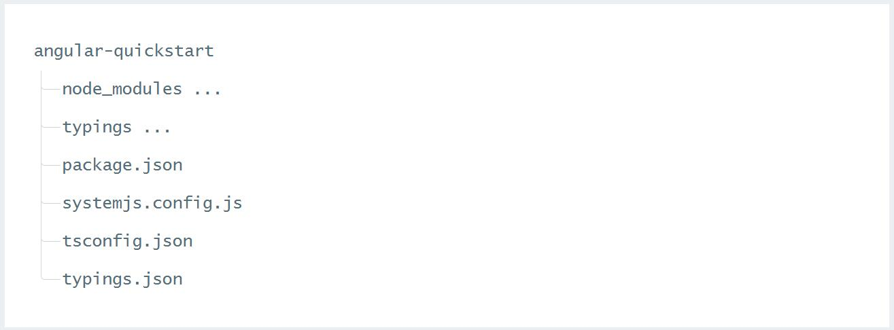
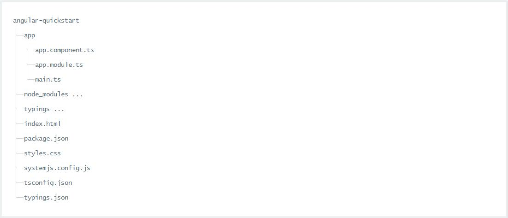

# Angular2


## Quick start

> 官方文档链接：[https://angular.io/docs/ts/latest/quickstart.html](https://angular.io/docs/ts/latest/quickstart.html)

### 现在用TypeScript构建一个应用

### Installing TypeScript

有两种安装TypeScript工具的方式：

* 通过 npm
* 安装TypeScript’s Visual Studio插件([Visual Studio 2015](https://www.typescriptlang.org/#download-links))

**For NPM users:**

> * 环境准备 : 安装 Node.js and npm
> * 步骤 1 ：创建并配置此项目
> * 步骤 2 ：创建应用
> * 步骤 3 ：创建组件并添加到应用程序中
> * 步骤 4 ：启动应用程序
> * 步骤 5 ：定义作为该应用的宿主的页面
> * 步骤 6 ：构建并运行此应用
> * 收工

### 环境准备

* 安装nodejs/npm
```
   node 》 v5.x.x  (v6.6.0)
   npm  》 v3.x.x  (v3.10.8)
```
需要 node v5.x.x 或更高版本以及 npm 3.x.x 或更高版本。 要检查你正在使用的版本，请在终端窗口中运行 node -v 和 npm -v 命令。

### 步骤 1 ：创建并配置此项目

* **创建工作目录**

使用终端窗口，为项目创建目录，并进入此目录

```
mkdir angular2-app
cd angular2-app
```


* **创建配置文件**

* package.json 用来标记出本项目所需的 npm 依赖包。<br/>
* tsconfig.json 定义了 TypeScript 编译器如何从项目源文件生成 JavaScript 代码。<br/>
* typings.json 为那些 TypeScript 编译器无法识别的库提供了别的定义文件。<br/>
* systemjs.config.js 为模块加载器提供了该到哪里查找应用模块的信息，并注册了所有必备的依赖包。 它还包括文档中后面的例子需要用到的包。<br/>

要了解这些配置文件的更多知识，参见 [npm 包配置指南](https://angular.cn/docs/ts/latest/guide/npm-packages.html) 和 [TypeScript 配置指南](https://angular.cn/docs/ts/latest/guide/typescript-configuration.html#!#tsconfig) 。


* **安装依赖包**

使用 npm 命令来安装 package.json 中列出的依赖包。请在终端窗口 ( 或 Windows 的 cmd 窗口 ) 中输入下列命令：

```

npm install 

```

在安装期间可能出现红色的错误信息，你还会看到 npm WARN 信息。不过不用担心，只要末尾处没有 npm ERR! 信息就算成功了。

你现在应该得到了如下结构：



* 如果没有typings目录，需手动安装

```
npm run typings install

```

现在，你可以开始写代码了！


### 步骤 2 ：创建应用

我们用 NgModules 把 Angular 应用组织成了一些功能相关的代码块。 Angular 本身也被拆成了一些独立的 Angular 模块。 这让你可以只导入你应用中所需的 Angular 部件，以得到较小的文件体积。

每个 Angular 应用都至少有一个模块： 根模块 ，在这里它叫做 AppModule 。

** 在应用的根目录下创建 app 子目录：

```
mkdir app

```

app/app.module.ts -->这里是应用的入口点

使用下列内容创建 app/app.module.ts 文件：

```
// app/app.module.ts

COPY CODE
import { NgModule }      from '@angular/core';
import { BrowserModule } from '@angular/platform-browser';

@NgModule({
  imports:      [ BrowserModule ]
})
export class AppModule { }
```

这里是应用的入口点。

由于 QuickStart 是运行在浏览器中的 Web 应用，所以根模块需要从 @angular/platform-browser 中导入 BrowserModule 并添加到 imports 数组中。

这是要让最小的应用在浏览器中运行时，对 Angular 的最低需求。

QuickStart 应用不做别的，也就先不需要其它模块。在真实的应用中，我们可能还得导入 FormsModule 、 RouterModule 和 HttpModule 。


### 步骤 3 ：创建组件并添加到应用中

每个 Angular 应用都至少有一个组件： 根组件 ，这里名叫 AppComponent 。

组件是 Angular 应用的基本构造块。每个组件都会通过与它相关的模板来控制屏幕上的一小块（视图）。

**使用下列内容创建组件文件** app/app.component.ts:

```
//app/app.component.ts

COPY CODE
import { Component } from '@angular/core';
@Component({
  selector: 'my-app',
  template: '<h1>My First Angular App</h1>'
})
export class AppComponent { }
```

QuickStart 应用具有和其它 Angular 组件相同的基本结构：

import 语句 。它让你能访问 Angular 核心库中的 @Component 装饰器函数 。

@Component 装饰器 ，它会把一份 元数据 关联到 AppComponent 组件类上：

selector 为用来代表该组件的 HTML 元素指定简单的 CSS 选择器。

template 用来告诉 Angular 如何渲染该组件的视图。

组件类 通过它的模板来控制视图的外观和行为。这里，你只有一个根组件 AppComponent 。由于这个简单的 QuickStart 范例中并不需要应用逻辑，因此它是空的。

我们还要 导出 这个 AppComponent 类，以便让刚刚创建的这个应用导入它。

编辑 app/app.module.ts 文件，导入这个新的 AppComponent ，并把它添加到 NgModule 装饰器中的 declarations 和 bootstrap 字段：

```
//app/app.module.ts

COPY CODE
import { NgModule }      from '@angular/core';
import { BrowserModule } from '@angular/platform-browser';
import { AppComponent }   from './app.component';
@NgModule({
  imports:      [ BrowserModule ],
  declarations: [ AppComponent ],
  bootstrap:    [ AppComponent ]
})
export class AppModule { }
```

### 步骤 4 ：启动应用

现在，我们还需要做点什么来让 Angular 加载这个根组件。

添加新文件

，内容如下：

```
//app/main.ts

COPY CODE
import { platformBrowserDynamic } from '@angular/platform-browser-dynamic';
import { AppModule } from './app.module';
const platform = platformBrowserDynamic();
platform.bootstrapModule(AppModule);
```

**为什么要分别创建 main.ts 、应用模块 和应用组件的文件呢？**
应用的引导过程与 创建模块或者 展现视图是相互独立的关注点。如果该组件不会试图运行整个应用，那么测试它就会更容易。


### 步骤 5 ：定义该应用的宿主页面

在 目录下创建 index.html 文件，并粘贴下列内容：

```
//index.html

COPY CODE
<html>
  <head>
    <title>Angular QuickStart</title>
    <meta charset="UTF-8">
    <meta name="viewport" content="width=device-width, initial-scale=1">
    <link rel="stylesheet" href="styles.css">
    <!-- 1. Load libraries -->
     <!-- Polyfill(s) for older browsers -->
    <script src="node_modules/core-js/client/shim.min.js"></script>
    <script src="node_modules/zone.js/dist/zone.js"></script>
    <script src="node_modules/reflect-metadata/Reflect.js"></script>
    <script src="node_modules/systemjs/dist/system.src.js"></script>
    <!-- 2. Configure SystemJS -->
    <script src="systemjs.config.js"></script>
    <script>
      System.import('app').catch(function(err){ console.error(err); });
    </script>
  </head>
  <!-- 3. Display the application -->
  <body>
    <my-app>Loading...</my-app>
  </body>
</html>
```

这里值得注意的地方有：

JavaScript 库： core-js 是为老式浏览器提供的填充库， zone.js 和 reflect-metadata 库是 Angular 需要的，而 SystemJS 库是用来做模块加载的。
SystemJS 的配置文件和一段脚本，它导入并运行了我们刚刚在 main 文件中写的 app 模块。
<body> 中的 <my-app> 标签是 应用程序生活的地方！

添加一些样式

样式不是必须的，但能让应用更漂亮。 index.html 中假定有一个叫做 styles.css 的样式表。

在 project root 目录下创建 styles.css 文件，并且用下面列出的最小化样式作为初始样式。

```
styles.css (excerpt)
COPY CODE
/* Master Styles */
h1 {
  color: #369;
  font-family: Arial, Helvetica, sans-serif;
  font-size: 250%;
}
h2, h3 {
  color: #444;
  font-family: Arial, Helvetica, sans-serif;
  font-weight: lighter;
}
body {
  margin: 2em;
}
```

### 步骤 6 ：编译并运行应用程序

打开终端窗口，并输入如下命令：

```
npm start
```

到 这里 了解更多关于 package.json 中其它脚本的知识。

该命令会同时运行两个并行的 node 进程：

TypeScript 编译器运行在监听模式。
一个名叫 lite-server 的静态文件服务器，它把 index.html 加载到浏览器中，并且在该应用中的文件发生变化时刷新浏览器。
稍后，一个浏览器页标签就会打开并显示出来。


### 收工

项目的最终目录结构看起来是这样的：



